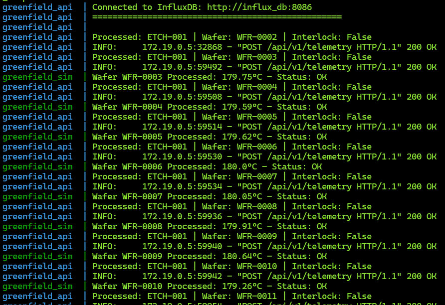
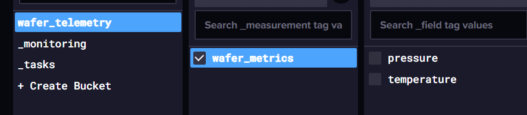
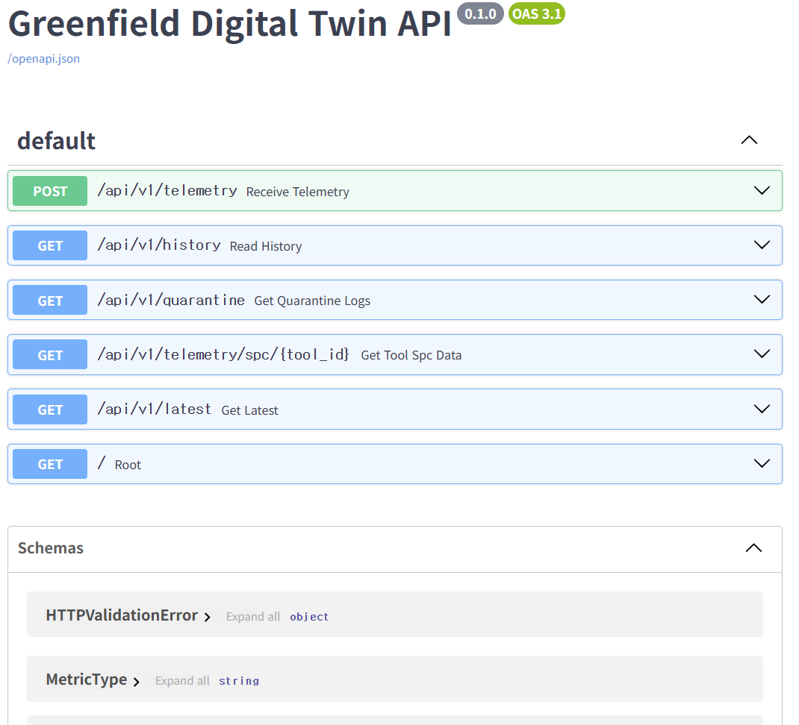

# Project Greenfield: Industrial Digital Twin


## 🏗️ Overview
This repository contains a **Digital Twin Prototype** designed to model a wafer lifecycle in a miniature semiconductor manufacturing environment. It demonstrates the intersection of high-frequency sensor telemetry and strict relational audit trails.


## 🛡️ IP & Security Disclaimer
**This project is a generic architectural demonstration and does not contain proprietary information.**
* **Data Integrity:** All telemetry data is synthetically generated using stochastic models and does not reflect real-world manufacturing recipes.
* **Architectural Neutrality:** The system design utilizes industry-standard open-source tools (FastAPI, InfluxDB, Postgres).
* **Compliance Awareness:** No proprietary schemas or hardware configurations from any specific manufacturer are utilized.


## 🧩 System Architecture

* **The Control Room (Frontend):** A modular Vue 3 dashboard using PrimeVue 4 for enterprise-grade UI components and **Chart.js** for real-time telemetry streaming.
* **The Nervous System (Backend):** An asynchronous FastAPI hub managing data validation, safety logic, and cross-database orchestration.
* **The Memory (InfluxDB):** A time-series engine optimized for high-frequency "firehose" data (temperature, pressure, etc) from tool sensors.
* **The Audit Trail (PostgreSQL):** A relational store for persistent "Safety Interlocks" and "Lot Quarantine" event logging, ensuring ACID-compliant traceability.

### 🛠️ Tech Stack
| Layer | Technology | Purpose |
| :--- | :--- | :--- |
| **Frontend** | Vue 3 + PrimeVue 4 | HUD & Real-time Charts |
| **API Framework** | FastAPI (Python 3.11) | Async logic |
| **Time-Series DB** | InfluxDB 2.7 (Flux) | Fast sensor telemetry |
| **Relational DB** | PostgreSQL 15 | Persistent audit & state management |
| **Containerization**| Docker & Docker Compose | Environment parity & orchestration |


## 🚦 Getting Started

### Prerequisites
* Docker and Docker Compose installed.
* Node.js (v20+) installed.

### Installation
1. **Clone the Repository:**
    ```bash
    git clone [https://github.com/skazler/wafer-fab-digital-twin.git](https://github.com/skazler/wafer-fab-digital-twin.git)
    cd wafer-fab-digital-twin
    ```
2. **Launch Infrastructure:**
    ```bash
    # Terminal 1: Infrastructure (Backend, DBs, Simulator)
    docker compose up --build
    ```
3. **Launch Control Room:**
    ```bash
    # Terminal 2: Frontend
    cd frontend
    npm install
    npm run dev
    ```

### What You'll See

<p align="center">
  
  <br>
  <em>Figure 1: Real-time Control Room HUD built with Vue 3 and PrimeVue.</em>
</p>

<p align="center">
  
  <br>
  <em>Figure 2: Wafer Fab Simulation.</em>
</p>

<p align="center">
  
  <br>
  <em>Figure 3: Example telemetry schema.</em>
</p>

<p align="center">
  
  <br>
  <em>Figure 4: Example API calls.</em>
</p>


## 🚀 Key Technical Features
* **Automated Safety Interlock:** Backend logic detects process excursions (e.g. temperature > 188.0°C) and triggers an immediate "Machine Stop."
* **Hybrid Data Traceability:** Dashboard displays live telemetry (InfluxDB) alongside permanent quarantine records (PostgreSQL).
* **Modular Design:** Frontend architecture uses Single File Components (SFCs) for separate concerns: `TelemetryStream.vue` and `QuarantineTable.vue`.


## 📈 Future Roadmap
* [ ] **OEE Analytics:** Real-time Availability, Performance, and Quality tracking.
* [ ] **Predictive Maintenance:** Machine learning models to predict tool failure based on sensor drift.
* [ ] **3D Twin Integration:** Integrating Three.js to visualize the physical tool state in 3D.


## 👋 Contact & Connect

**Sky H. Yoo** 📧 [yooskyh@gmail.com](mailto:yooskyh@gmail.com)

I’m a developer passionate about resilient and scalable solutions and modern software stacks. If you have questions about this architecture, feel free to reach out—I'm always happy to chat and learn something new!