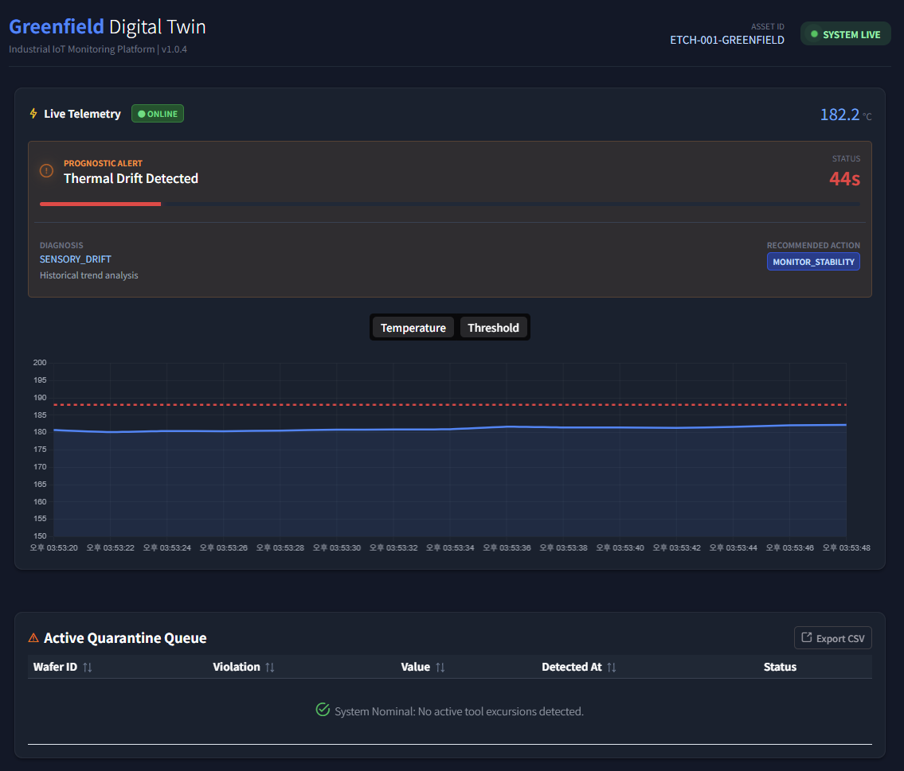

# Project Greenfield: Industrial Digital Twin


## 🏗️ Overview
This repository contains a **Digital Twin Prototype** designed to model a wafer lifecycle in a miniature semiconductor manufacturing environment. It demonstrates the intersection of high-frequency sensor telemetry and strict relational audit trails.


## 🛡️ IP & Security Disclaimer
**This project is a generic architectural demonstration and does not contain proprietary information.**
* **Data Integrity:** All telemetry data is synthetically generated using stochastic models and does not reflect real-world manufacturing recipes.
* **Architectural Neutrality:** The system design utilizes industry-standard open-source tools (FastAPI, InfluxDB, Postgres).
* **Compliance Awareness:** No proprietary schemas or hardware configurations from any specific manufacturer are utilized.


## 🧩 System Architecture

* **The Control Room (Frontend):** A modular Vue 3 dashboard using PrimeVue 4 for enterprise-grade UI components and **Chart.js** for real-time telemetry streaming.
* **The Nervous System (Backend):** An asynchronous FastAPI hub managing data validation, safety logic, and cross-database orchestration.
* **The Memory (InfluxDB):** A time-series engine optimized for high-frequency "firehose" data (temperature, pressure, etc) from tool sensors.
* **The Audit Trail (PostgreSQL):** A relational store for persistent "Safety Interlocks" and "Lot Quarantine" event logging, ensuring ACID-compliant traceability.

### 🛠️ Tech Stack
| Layer | Technology | Purpose |
| :--- | :--- | :--- |
| **Frontend** | Vue 3 + PrimeVue 4 | HUD with intelligent loading & interlock logic |
| **API Framework** | FastAPI (Python 3.11) | Async orchestration |
| **Analysis Engine** | SciPy (LinReg) | Predictive drift & RCA diagnostics |
| **Time-Series DB** | InfluxDB 2.7 (Flux) | High-frequency sensor telemetry |
| **Relational DB** | PostgreSQL 15 | Persistent interlock logging & audit trail |

## 🚀 Key Technical Features

### 🧠 Intelligent PdM Engine
Beyond simple thresholds, the `SmartAnalysisService` utilizes **SciPy Linear Regression** and **Fast Learning adaptive filters** to monitor real-time thermal drift and forecast tool failure.

### 🔍 Root Cause Analysis (RCA) Engine
The system cross-references sensor correlations to automatically identify the source of excursions. 
* **Example:** If temperature rises while gas flow decreases, the system flags a `GAS_LEAK_DETECTION` rather than a generic heater error.

### 🛡️ Automated Safety Interlocks & State Recovery
* **Persistent Interlock:** Backend logic detects process excursions (e.g., $>188.0$ °C) and triggers an immediate "Machine Stop."
* **`wasInterlocked` Logic:** The UI implements a persistent state lock. If a tool crashes, the dashboard remains in a "Critical" state even if the data stream stops, preventing "stale" or "nominal" reports during a hardware failure.
* **Reset Loop:** A secure `POST /system/reset` endpoint allows operators to clear the interlock state and resume the simulation once the fault is mitigated.

### 📡 High-Fidelity Connectivity Management
* **Real-time Heartbeat:** Frontend monitors data "freshness" using computed watchers to toggle between **Online** and **Offline** states.
* **Inferred Shutdown:** The UI intelligently detects tool crashes even if the network packet stream cuts out mid-excursion by analyzing the last known Remaining Useful Life (RUL).

## 🚦 Getting Started

### Prerequisites
* Docker and Docker Compose installed.
* Node.js (v20+) installed.

### Installation
1. **Clone the Repository:**
    ```bash
    git clone [https://github.com/skazler/wafer-fab-digital-twin.git](https://github.com/skazler/wafer-fab-digital-twin.git)
    cd wafer-fab-digital-twin
    ```
2. **Launch Infrastructure:**
    ```bash
    # Terminal 1: Infrastructure (Backend, DBs, Simulator)
    docker compose up --build
    ```
3. **Launch Control Room:**
    ```bash
    # Terminal 2: Frontend
    cd frontend
    npm install
    npm run dev
    ```

### 📸 What You'll See

<p align="center">
  
  <br>
  <em>Figure 1: Real-time drift detection that provides corrective recommendations and automated countermeasures.</em>
</p>

<p align="center">
  
  <br>
  <em>Figure 2: Wafer Fab Simulation.</em>
</p>


## 🔬 Technical Deep Dive

### RUL & Diagnostic Logic
The `SmartAnalysisService` calculates the **Remaining Useful Life (RUL)** and determines the countermeasure strategy:

1.  **Regression:** We solve for $y = mx + b$ using the latest 30-point window.
2.  **Forecasting:** $$RUL = \frac{\text{Safety Threshold} - \text{Current Value}}{m}$$
3.  **UI Feedback:** A dynamic progress bar provides a visual "Glow" effect when $RUL < 60s$ to signal immediate operator intervention.

## 📈 Future Roadmap

* [ ] **Automated Countermeasures (Closed-Loop Control):** Developing a feedback mechanism where the backend can issue "Throttle" commands to the simulator to mitigate drift before a safety interlock is triggered.
* [ ] **Explainable AI (XAI) Dashboarding:** Enhancing prognostic alerts with "Reasoning" strings that detail the statistical confidence and specific sensor correlations driving the failure prediction.
* [ ] **OEE Analytics:** Real-time Availability, Performance, and Quality tracking to benchmark tool productivity.
* [ ] **3D Twin Integration:** Integrating Three.js to visualize the physical tool state and sensor heatmaps in a 3D environment.


## 👋 Contact & Connect

**Sky H. Yoo** 📧 [yooskyh@gmail.com](mailto:yooskyh@gmail.com)

I’m a developer passionate about resilient and scalable solutions and modern software stacks. If you have questions about this architecture, feel free to reach out—I'm always happy to chat and learn something new!