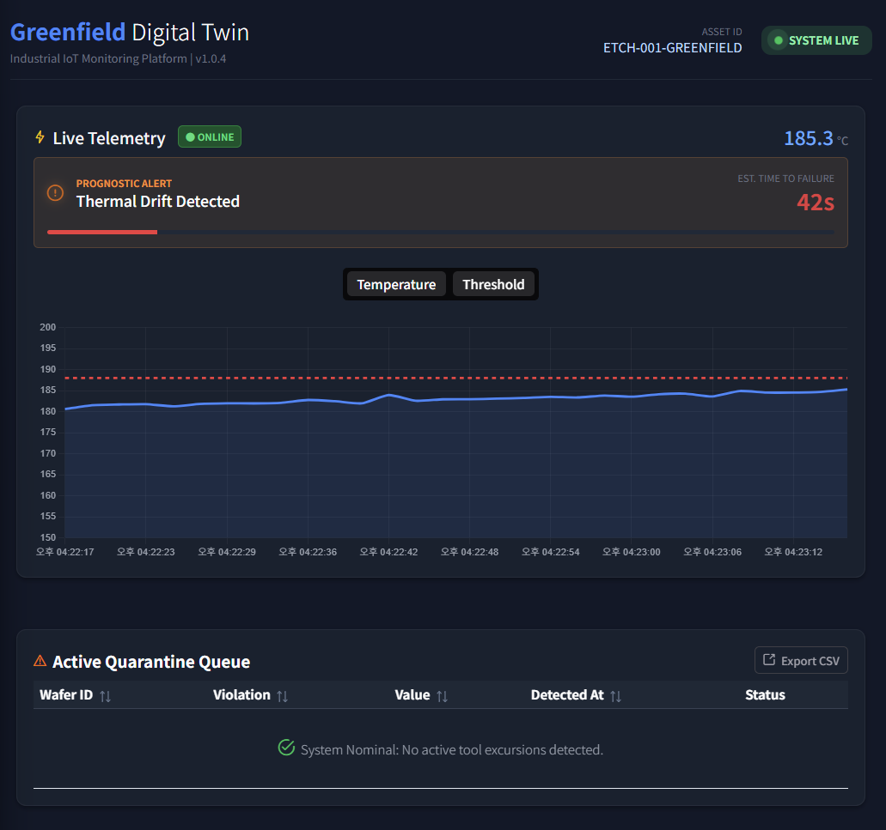
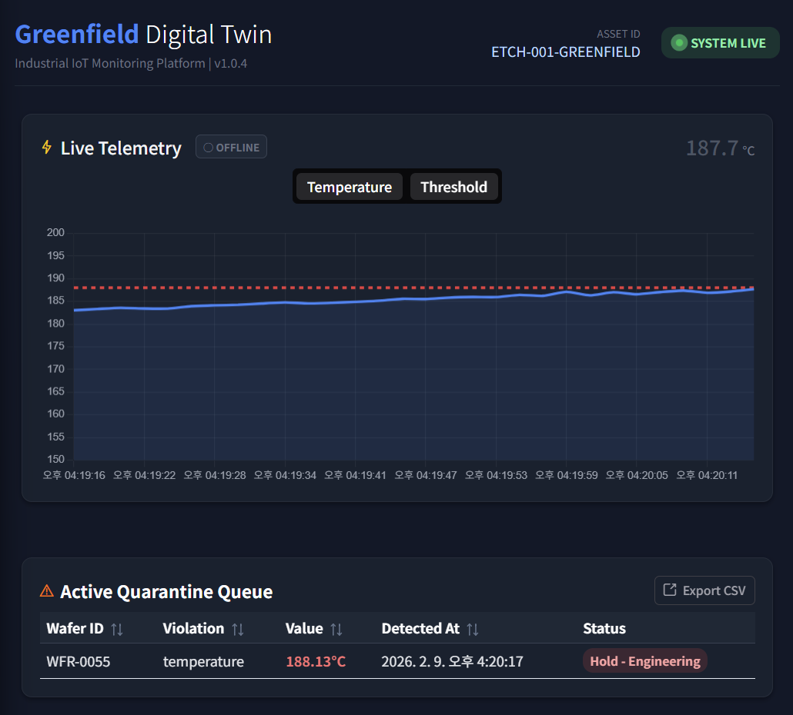

# Project Greenfield: Industrial Digital Twin


## 🏗️ Overview
This repository contains a **Digital Twin Prototype** designed to model a wafer lifecycle in a miniature semiconductor manufacturing environment. It demonstrates the intersection of high-frequency sensor telemetry and strict relational audit trails.


## 🛡️ IP & Security Disclaimer
**This project is a generic architectural demonstration and does not contain proprietary information.**
* **Data Integrity:** All telemetry data is synthetically generated using stochastic models and does not reflect real-world manufacturing recipes.
* **Architectural Neutrality:** The system design utilizes industry-standard open-source tools (FastAPI, InfluxDB, Postgres).
* **Compliance Awareness:** No proprietary schemas or hardware configurations from any specific manufacturer are utilized.


## 🧩 System Architecture

* **The Control Room (Frontend):** A modular Vue 3 dashboard using PrimeVue 4 for enterprise-grade UI components and **Chart.js** for real-time telemetry streaming.
* **The Nervous System (Backend):** An asynchronous FastAPI hub managing data validation, safety logic, and cross-database orchestration.
* **The Memory (InfluxDB):** A time-series engine optimized for high-frequency "firehose" data (temperature, pressure, etc) from tool sensors.
* **The Audit Trail (PostgreSQL):** A relational store for persistent "Safety Interlocks" and "Lot Quarantine" event logging, ensuring ACID-compliant traceability.

### 🛠️ Tech Stack
| Layer | Technology | Purpose |
| :--- | :--- | :--- |
| **Frontend** | Vue 3 + PrimeVue 4 | HUD & Real-time Charts |
| **API Framework** | FastAPI (Python 3.11) | Async logic |
| **PdM Engine** | SciPy (Linear Regression) | Predictive drift analysis |
| **Time-Series DB** | InfluxDB 2.7 (Flux) | Fast sensor telemetry |
| **Relational DB** | PostgreSQL 15 | Persistent audit & state management |
| **Containerization**| Docker & Docker Compose | Environment parity & orchestration |


## 🚦 Getting Started

### Prerequisites
* Docker and Docker Compose installed.
* Node.js (v20+) installed.

### Installation
1. **Clone the Repository:**
    ```bash
    git clone [https://github.com/skazler/wafer-fab-digital-twin.git](https://github.com/skazler/wafer-fab-digital-twin.git)
    cd wafer-fab-digital-twin
    ```
2. **Launch Infrastructure:**
    ```bash
    # Terminal 1: Infrastructure (Backend, DBs, Simulator)
    docker compose up --build
    ```
3. **Launch Control Room:**
    ```bash
    # Terminal 2: Frontend
    cd frontend
    npm install
    npm run dev
    ```

### 📸 What You'll See

<p align="center">
  
  <br>
  <em>Figure 1: Real-time drift detection that triggers tool shutdown.</em>
</p>


<p align="center">
  
  <br>
  <em>Figure 2: Problematic wafer added to quarantine.</em>
</p>

<p align="center">
  
  <br>
  <em>Figure 3: Wafer Fab Simulation.</em>
</p>

<p align="center">
  
  <br>
  <em>Figure 4: Example telemetry schema.</em>
</p>

<p align="center">
  
  <br>
  <em>Figure 5: Example API calls.</em>
</p>


## 🚀 Key Technical Features
* **Predictive Maintenance (PdM) Engine:** The system features a custom `PdmService` that utilizes **SciPy Linear Regression** to monitor real-time thermal drift and forecast tool failure.
* **Automated Safety Interlock:** Backend logic detects process excursions (e.g. temperature > 188.0°C) and triggers an immediate "Machine Stop."
* **Real-time Connectivity Management:** Frontend implements computed watchers to monitor data "freshness," UI automatically toggles between **Online** and **Offline** states based on telemetry ingestion frequency, and backend freshness checks ensure prognostic widgets clear automatically when a tool shuts down, preventing "stale" alerts.
* **Hybrid Data Traceability:** Dashboard displays live telemetry (InfluxDB) alongside permanent quarantine records (PostgreSQL).
* **Modular Design:** Frontend architecture uses Single File Components (SFCs) for separate concerns: `TelemetryStream.vue` and `QuarantineTable.vue`.

### 🔬 Technical Deep Dive: RUL Calculation
The `PdmService` calculates the **Remaining Useful Life (RUL)** by analyzing the last 30 telemetry points.

1.  **Normalization:** Time series data is converted into seconds elapsed from the start of the sampling window ($x_{rel}$).
2.  **Regression:** Using `scipy.stats.linregress`, we solve for $y = mx + b$, where $m$ is the drift rate (slope).
3.  **Stability Filter:** Slopes below $0.005$ °C/s are ignored to prevent noise-driven false positives.
4.  **Forecasting:** The time to failure is calculated as:
    $$RUL = \frac{Threshold - CurrentValue}{m}$$


## 📈 Future Roadmap

* [ ] **Fast Learning Adaptive Thresholds:** Implementing Exponential Moving Averages (EMA) to allow the PdM engine to "learn" process baselines dynamically across different recipe profiles.
* [ ] **Root Cause Analysis (RCA) Engine:** Expanding the telemetry schema to include multi-variate correlation (e.g., Coolant Pressure vs. Chamber Temp) to automatically identify the source of excursions.
* [ ] **Automated Countermeasures (Closed-Loop Control):** Developing a feedback mechanism where the backend can issue "Throttle" commands to the simulator to mitigate drift before a safety interlock is triggered.
* [ ] **Explainable AI (XAI) Dashboarding:** Enhancing prognostic alerts with "Reasoning" strings that detail the statistical confidence and specific sensor correlations driving the failure prediction.
* [ ] **OEE Analytics:** Real-time Availability, Performance, and Quality tracking to benchmark tool productivity.
* [ ] **3D Twin Integration:** Integrating Three.js to visualize the physical tool state and sensor heatmaps in a 3D environment.


## 👋 Contact & Connect

**Sky H. Yoo** 📧 [yooskyh@gmail.com](mailto:yooskyh@gmail.com)

I’m a developer passionate about resilient and scalable solutions and modern software stacks. If you have questions about this architecture, feel free to reach out—I'm always happy to chat and learn something new!